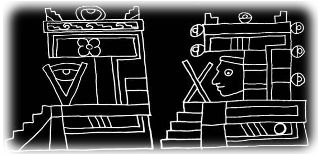
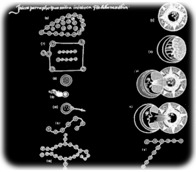
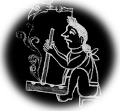
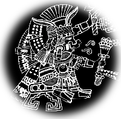

# Aztec

## Introduction

For ancient aztecs, the knowledge of the night skies and stars movement had great importance for their calendars and the measurement of both agricultural and sacred cycles. However, great part of this knowledge was lost as consequence of the Spanish conquest which occurred on continental America in the 16th century.

## Description

The elements of the Aztec society such as culture, economy and science is preserved in the _tlacuilos_, word that comes from the ancient Nahuatl word _tlacuiloa_, which means _writing with drawings_. These Tlacuilos where stored in the _amoxcalli_, meaning amoxtli: books and calli: house. Later their became known as _codices_; a word that came from the Latin word Codex which means written book.

After the Spanish conquest many of the pre-hispanic Codexes where destroyed, their main feature is that their where drawn in many different materials such as deer skin, _amate_ paper or cotton fabric and they had no text only draws or _glifos_. However the collection of Mesoamerican customs continued prior to the Spanish conquest thanks to the work of some native indians and some Spanish priests, this codexes are known as Colonial Codexes and there is a change of the way of drawing because of the new techniques of drawing and the new materials imported from Europe, also because of the incorporation of descriptive text both in Spanish and Nahuatl.

Astronomical building
{: .img_and_caption }

Sadly, the Aztec astronomical knowledge in the remaining codexes is really small. The next image is one of the few that names some constellations and astronomical phenomena identified by the Aztec, it belong to the _Primeros Memoriales_ (first memorials), which is a colonial manuscript of the 16th century written by Fray Bernardino de Sahagun.

### Conclusion

It is noteworthy that the interpretation of some of these constellations are still in discussion, and of course there must be other constellations to represent. Any comments and/or collaboration are welcome in order to preserve the stellar knowledge and meaning of the Aztec culture.

### Thanks to

 - Javier Gómez Sandoval
 - Martha Patricia Rivera
 - Emilio Ramón Bolaños Guerra
 - Hector Vega
 - Rafael Rojas Segoviano
 - Juan Caballero
 - SAAGS

## Constellations

##### Mamalhuaztli

Ancient Aztec identified the Orion's Belt as Mamalhuaztli, and it represented the wood sticks used to light the new fire in the commemoration celebrated every 52 years by the Mexicans and their neighbors named _toxiuh molpilia_ which means binding of the years and coincided with the beginning of the new year named _xiuhtzitzquilo_.

##### Tianquiztli

The group of stars that we know as Pleiades symbolized for the Mexicas _Tianquiztli_, which means market, perhaps because of the crowd that gathers on them, they're generally represented by one or two people inside a circle with goods.

Currently, in Mexico the informal market or street markets are called _Tianguis_.

##### Citlaltlachtli

The constellation of Gemini was called _Citlaltlachtli_, which means the ball game of the stars. This game was endowed with a ritual significance and used a natural rubber ball. It is said that the movement of the ball within the playing field refers to the movement of the sun and moon.

##### Xonecuilli

The Ursa Minor constellation is identified as _Xonecuilli_ which means twisted foot, and is related to Nanahuatzin, this character is represented with twisted feet, filled with boils and sores, this sick and poor God sacrificed himself to become _Tonatiuh_ the Sun god.

Apparently, this constellation can also be associated with the Southern Cross and its surrounding stars as is referred by _Tezozomoc_. For its part, Sahagun speaks of his resemblance to bread made in the form of letter S and called by the Aztecs _xonecuilli_.

Xonecuilli
{: .img_and_caption }

##### Colotl Ixayac

According to the Florentino Codex Sahagun's informants identified a group of stars known as _Citlalcolotl_, the scorpion star. In turn, Tezozomoc also mentions the scorpion star and he called it _Colotlixayac_, which means face of a scorpion.

In a section of the Paris Codex called zodiac pages appears the scorpion, in this codex the icons shows figures of animals hanging from the body of the Celestial Dragon.
{: .img_and_caption }

## References

 - [#1]: [Fuego Nuevo](http://biblioteca.itam.mx/estudios/estudio/letras30/notas3/sec_1.html)
 - [#2]: [Constelaciones Prehispánicas](http://www.montero.org.mx/constelaciones.htm)
 - [#3]: [The Question of the Zodiac in America](http://www.jstor.org/stable/660290?origin=JSTOR-pdf)
 - [#4]: [Aztec Mythology](http://www.windows2universe.org/mythology/aztec_culture.html)
 - [#5]: [Los códices de México](http://www.iconio.com/ABCD/F/INDEX.PDF)
 - [#6]: [Los códices coloniales de México](http://es.wikipedia.org/wiki/C%C3%B3dices_coloniales_de_M%C3%A9xico)
 - [#7]: [Real cédula prohibiendo la historia general de las cosas de Nueva España de Fray Bernardino de Sahagún](http://www.traduccionliteraria.org/1611/esc/america/sahagun.htm)
 - [#8]: [Akapochtli](http://commons.wikimedia.org/wiki/User:Akapochtli)
 - [#9]: [Iconografía mexicana, Volumen 3](http://books.google.com.mx/books?id=kxPjdY1PJjEC&amp;pg=PA118&amp;lpg=PA118&amp;dq=Colotlixayac&amp;source=bl&amp;ots=F6xlTU1rer&amp;sig=9q_8ApdMTw5l9kagolArj5cPSMk&amp;hl=es&amp;ei=xoMeS8ToJoS1tgfpwv2cCg&amp;sa=X&amp;oi=book_result&amp;ct=result&amp;resnum=5&amp;ved=0CBsQ6AEwBA#v=onepage&amp;q=Colotlixayac&amp;f=false)
 - [#10]: [El Códice París](http://www.famsi.org/spanish/mayawriting/codices/paris.html)
 - [#11]: [El nacimiento del sol y la luna](http://redescolar.ilce.edu.mx/redescolar/biblioteca/literatura/leyenda/mexicas/mexsolun.html)
 - [#12]: [Diccionario náhuatl - español en línea en AULEX](http://aulex.org/nah-es/)
 - [#13]: [Tlachtli](http://sepiensa.org.mx/contenidos/fd_depo/nahuatl/tlach_1.html)

## Authors

Enrique Gómez Candelario [aldeaglobal@gmail.com](mailto:aldeaglobal@gmail.com), [http://www.wirikuta.org/comala](http://www.wirikuta.org/comala)

English translation by Rafael Rojas Segoviano

## Licence

GNU GPL v2.0
