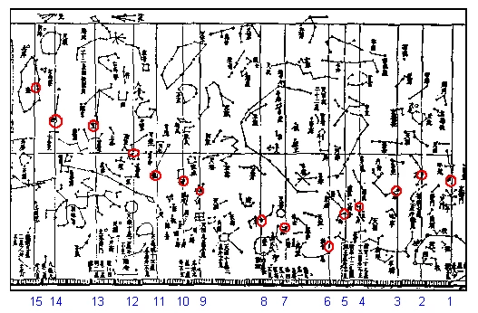

# Japanese Moon Stations

## Introduction

Most astronomical observation in Japan until the Meiji Restoration was closely tied to astrological purposes. For ancient Chinese and later Korean and Japanese cartographers four seasons and four cardinal directions is marked as four talismanic animals - the Azure Dragon of the East (Spring), the Red Bird of the South (Summer), the White Tiger of the West (Fall), and the "Genbu" (Black Tortoise) of the North (Winter). Corresponding to each of the talismanic animals the celestial "palaces" were seven sei shuku or what are sometimes called "lunar lodges". The moon "stations" or "lodges" probably may be used to determine position of sun and planets as well as the moon, and their number may or may not have been related to the period of the moon's orbit. Origins of these associations are obscure and even controversial.

## Description

Determination of the talismanic animals and associated star "palaces" together with the associated 28 _sei shuku_ or lunar lodges represent some of the most complex aspects of Asian "astronomy". An apparent anomaly is the fact that the actual positional path of the sun seems to move in a direction opposite the seasonal associations of Spring and Fall. Some scientists argues that this is due to the animals and sei shuku being created some 17 to 18 millennia ago (precession creating the anomaly), but it does not really explain the apparent "backward" motion of the sun through seasons.

According to some scientists, the talismanic animals with their associated sei shuku were probably used in conjunction with the direction to which the handle of the big dipper (often called the "North Seven Stars" in China, Korea, and Japan) pointed at the equinoxes and solstices. Before the Christian Era, when the sei shuku were created, the big dipper did not appear to set, because they had a relatively "higher" position than now. 

Like myths and traditions in Western cultures, these views still wield influence in the daily life of people in China, Korea, and Japan (this despite quite prominent scientific literacy). However, it should be pointed out that astrological divination in China, Korea and Japan was and is rather complex.

The lore related to moon stations is one of the most interesting aspects of Asian Ethnoastronomy. Japanese interpretations of these associations tended to revolve around agricultural needs and animistic views of nature. Unlike many Western myths and traditions, japanese gods in the similitude of the talismanic animals can be seen as manifestations of nature.

Below is an example of a star chart from Edo Era Japan.

  
_Close-Up of Yasui's Map Showing the First 15 Moon Stations_

### The Azure Dragon of the East (Spring)

The 7 Moon Stations of the "East" or "Blue Dragon".

<table class="nomenclature">
<tr>
<td>#</td>
<td>Chinese Character</td>
<td>Meaning</td>
<td>Key Star</td>
<td>Japanese Name</td>
</tr>
<tr>
<td>1</td>
<td></td>
<td>Horn(s), perhaps Angle, Corner</td>
<td>Alpha Vir</td>
<td>SuBoshi</td>
</tr>
<tr>
<td>2</td>
<td></td>
<td>Neck, Throat</td>
<td>Kappa Vir</td>
<td>AmiBoshi</td>
</tr>
<tr>
<td>3</td>
<td></td>
<td>Root, perhaps Shoulder or Base</td>
<td>Iota Lib; sometimes Alpha Lib</td>
<td>TomoBoshi</td>
</tr>
<tr>
<td>4</td>
<td></td>
<td>Chamber, perhaps Breasts</td>
<td>Delta Sco; sometimes Pi Sco</td>
<td>SoiBoshi</td>
</tr>
<tr>
<td>5</td>
<td></td>
<td>Heart</td>
<td>Sigma Sco</td>
<td>NakagoBoshi</td>
</tr>
<tr>
<td>6</td>
<td></td>
<td>Tail</td>
<td>Mu Sco</td>
<td>AshitareBoshi</td>
</tr>
<tr>
<td>7</td>
<td></td>
<td>Basket</td>
<td>Gamma Sgr; sometimes Eta Sgr</td>
<td>MiBoshi</td>
</tr>
</table>

### The "Genbu" (Black Tortoise) of the North (Winter)

The 7 Moon Stations of the "North" (Genbu) or "Black Tortoise of Winter" (also "Somber" or "Black" Warrior).

<table class="nomenclature">
<tr>
<td>#</td>
<td>Chinese Character</td>
<td>Meaning</td>
<td>Key Star</td>
<td>Japanese Name</td>
</tr>
<tr>
<td>8</td>
<td></td>
<td>Dipper; Measure</td>
<td>Phi Sgr</td>
<td>HikitsuBoshi</td>
</tr>
<tr>
<td>9</td>
<td></td>
<td>Cow</td>
<td>Beta Cap</td>
<td>InamiBoshi</td>
</tr>
<tr>
<td>10</td>
<td></td>
<td>Woman; perhaps Waiting Maid</td>
<td>Epsilon Aqr</td>
<td>UrukiBoshi</td>
</tr>
<tr>
<td>11</td>
<td></td>
<td>Emptiness</td>
<td>Beta Aqr</td>
<td>TomiteBoshi</td>
</tr>
<tr>
<td>12</td>
<td></td>
<td>Roof Top, perhaps Danger, Steep</td>
<td>Alpha Aqr</td>
<td>UmiyameBoshi</td>
</tr>
<tr>
<td>13</td>
<td></td>
<td>Room, perhaps Encampment</td>
<td>Alpha Peg</td>
<td>HatsuiBoshi</td>
</tr>
<tr>
<td>14</td>
<td></td>
<td>Wall</td>
<td>Gamma Peg</td>
<td>NamameBoshi</td>
</tr>
</table>

### The White Tiger of the West (Fall)

The 7 Moon Stations of the "West" or "White Tiger".

<table class="nomenclature">
<tr>
<td>#</td>
<td>Chinese Character</td>
<td>Meaning</td>
<td>Key Star</td>
<td>Japanese Name</td>
</tr>
<tr>
<td>15</td>
<td></td>
<td>Stride, Foot</td>
<td>Delta And</td>
<td>TokakiBoshi</td>
</tr>
<tr>
<td>16</td>
<td></td>
<td>Hill, Lasso; perhaps Bellows</td>
<td>Beta Ari</td>
<td>TataraBoshi</td>
</tr>
<tr>
<td>17</td>
<td></td>
<td>Stomach</td>
<td>35 Ari</td>
<td>EkieBoshi</td>
</tr>
<tr>
<td>18</td>
<td></td>
<td>Stopping Place, United; perhaps "Getting Together"</td>
<td>17 Tau; sometimes 16 Tau</td>
<td>SubaruBoshi</td>
</tr>
<tr>
<td>19</td>
<td></td>
<td>Net; perhaps related to Rain</td>
<td>Epsilon Tau</td>
<td>AmefuriBoshi</td>
</tr>
<tr>
<td>20</td>
<td></td>
<td>Turtle Snout, perhaps Tuft on Owl's Head</td>
<td>Turtle Snout, perhaps Tuft on Owl's Head</td>
<td>TorokiBoshi</td>
</tr>
<tr>
<td>21</td>
<td></td>
<td>Investigator, Three</td>
<td>Delta Ori; sometimes Beta Ori</td>
<td>KagasukiBoshi</td>
</tr>
</table>

### The Red Bird of the South (Summer)

The 7 Moon Stations of the "South" or "Red Bird".

<table class="nomenclature">
<tr>
<td>#</td>
<td>Chinese Character</td>
<td>Meaning</td>
<td>Key Star</td>
<td>Japanese Name</td>
</tr>
<tr>
<td>22</td>
<td></td>
<td>Well</td>
<td>Mu Gem</td>
<td>ChichiriBoshi</td>
</tr>
<tr>
<td>23</td>
<td></td>
<td>Ogre, Devil, perhaps Ghost</td>
<td>Delta Cnc; sometimes Theta Cnc</td>
<td>TamahomeBoshi</td>
</tr>
<tr>
<td>24</td>
<td></td>
<td>Willow</td>
<td>Delta Hya</td>
<td>NurikoBoshi</td>
</tr>
<tr>
<td>25</td>
<td></td>
<td>Stars</td>
<td>Alpha Hya</td>
<td>HotohoriBoshi</td>
</tr>
<tr>
<td>26</td>
<td></td>
<td>Stretched Net</td>
<td>Nu Hya</td>
<td>ChirikoBoshi</td>
</tr>
<tr>
<td>27</td>
<td></td>
<td>Wings</td>
<td>Alpha Crt</td>
<td>TasukiBoshi</td>
</tr>
<tr>
<td>28</td>
<td></td>
<td>Chariot Cross-Board, perhaps strings of Koto</td>
<td>Gamma Crv</td>
<td>MitsukakeBoshi</td>
</tr>
</table>

### External links

*   <a href="http://www.academia.edu/5293593/A_Cultural_History_of_Astronomy_in_Japan" rel="nofollow">A Cultural History of Astronomy in Japan</a> by Steve Renshaw

## References

## Authors

Alexander Wolf

## Licence

GNU GPL v2.0
